# BA2 Analysebericht

## 1. Primaer-Track: Echtdaten

**K-Means Modellauswahl (real)**

|     k |    inertia |   silhouette |   davies_bouldin |   calinski_harabasz |
|------:|-----------:|-------------:|-----------------:|--------------------:|
| 2.000 | 313573.846 |        0.192 |            2.143 |            1095.055 |
| 3.000 | 284963.340 |        0.167 |            1.869 |             952.511 |
| 4.000 | 260458.766 |        0.169 |            1.577 |             913.330 |
| 5.000 | 236769.484 |        0.201 |            1.428 |             927.815 |
| 6.000 | 222201.384 |        0.141 |            1.621 |             882.210 |
| 7.000 | 211651.194 |        0.117 |            1.652 |             829.619 |
| 8.000 | 203976.845 |        0.104 |            1.753 |             775.205 |

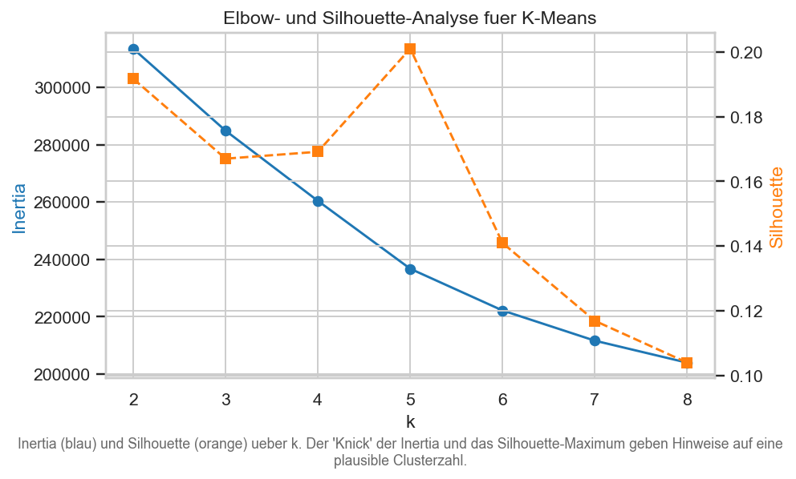

**GMM Modellauswahl (real)**

|     k |         bic |         aic |   silhouette |
|------:|------------:|------------:|-------------:|
| 2.000 |  -53428.296 |  -73027.217 |        0.318 |
| 3.000 | -105400.395 | -134802.201 |        0.222 |
| 4.000 | -182152.754 | -221357.446 |        0.110 |
| 5.000 | -215967.898 | -264975.475 |        0.065 |
| 6.000 | -225250.874 | -284061.338 |        0.063 |
| 7.000 | -223761.334 | -292374.683 |        0.079 |
| 8.000 | -221770.268 | -300186.502 |        0.031 |

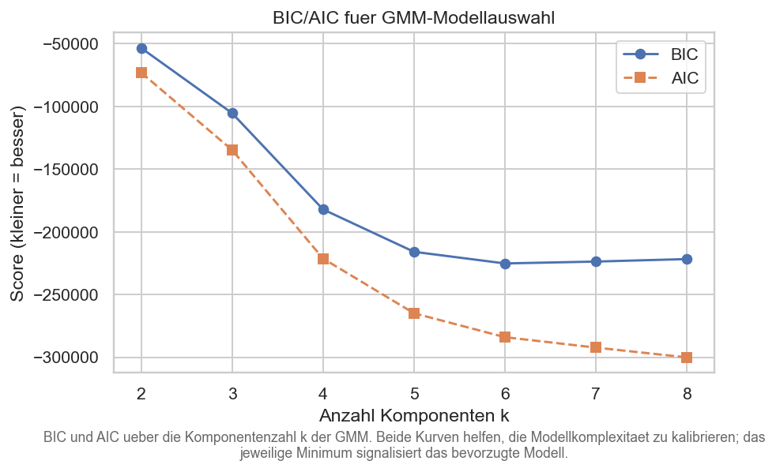

k-Auswahl (Silhouette-Max + BIC-Knee):

|   k_silhouette |   k_bic_knee |   k_used |
|---------------:|-------------:|---------:|
|              5 |            8 |        8 |

**Benchmark real** (Spalte `degenerate=True` markiert Pathologien: DBSCAN-1-Cluster-mit-Noise und AHC-Average-Chaining (>90% in einem Cluster); diese werden bei der 'best' Auswahl ausgeschlossen, weil ihre hohen internen Metriken Artefakte einer trivialen Partition sind):

| algorithm   |   n_clusters |   n_noise |   max_cluster_share | degenerate   |   silhouette |   davies_bouldin |   calinski_harabasz |   stability_mean_ari |   stability_std_ari |
|:------------|-------------:|----------:|--------------------:|:-------------|-------------:|-----------------:|--------------------:|---------------------:|--------------------:|
| kmeans      |            8 |         0 |               0.274 | False        |        0.104 |            1.753 |             775.205 |                0.612 |               0.150 |
| gmm_full    |            8 |         0 |               0.482 | False        |        0.031 |            2.225 |             534.024 |                0.518 |               0.130 |
| gmm_diag    |            8 |         0 |               0.404 | False        |        0.047 |            2.327 |             499.778 |                0.726 |               0.198 |
| ahc_ward    |            8 |         0 |               0.500 | False        |        0.142 |            1.389 |             656.944 |                0.368 |               0.069 |
| ahc_avg     |            8 |         0 |               0.994 | True         |        0.638 |            0.551 |             165.177 |                0.874 |               0.039 |
| spectral    |            8 |         0 |               0.469 | False        |        0.145 |            1.506 |             523.832 |                0.675 |               0.180 |
| dbscan      |            1 |       189 |               1.000 | True         |      nan     |          nan     |             nan     |                0.982 |               0.014 |

Bester nicht-degenerierter Algorithmus auf real nach Bootstrap-Stabilitaet: `gmm_diag` (Stability ARI = 0.726).

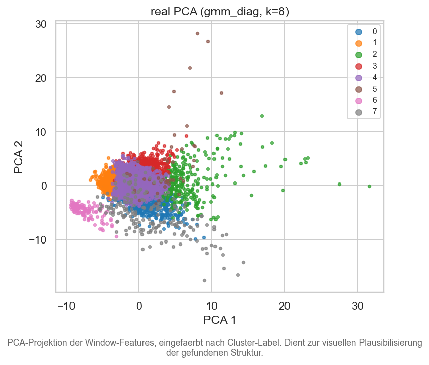

**Cluster-Signaturen (real, kompakt - Schluesselfeatures je Cluster; vollstaendige Tabelle in `tables/real_cluster_signatures.csv`):**

|   cluster |   speed_mps_mean |   speed_mps_std |   linacc_mag_mean |   linacc_mag_std |   gyro_mag_mean |   gyro_mag_std |   linacc_mag_cadence_energy |   linacc_mag_vibration_energy |   stop_ratio |   stop_transitions |
|----------:|-----------------:|----------------:|------------------:|-----------------:|----------------:|---------------:|----------------------------:|------------------------------:|-------------:|-------------------:|
|     0.000 |            2.139 |           0.766 |             2.160 |            1.255 |           0.557 |          0.372 |                       0.212 |                         0.606 |        0.063 |              1.529 |
|     1.000 |            2.952 |           0.615 |             1.653 |            0.899 |           0.272 |          0.160 |                       0.099 |                         0.387 |        0.006 |              0.516 |
|     2.000 |            3.001 |           0.764 |             3.346 |            2.533 |           0.569 |          0.370 |                       0.988 |                         2.004 |        0.017 |              0.586 |
|     3.000 |            3.496 |           0.843 |             2.922 |            1.818 |           0.361 |          0.201 |                       0.422 |                         1.381 |        0.003 |              0.566 |
|     4.000 |            3.067 |           0.541 |             2.314 |            1.320 |           0.416 |          0.252 |                       0.218 |                         0.757 |        0.000 |              0.000 |
|     5.000 |            5.056 |           2.744 |             2.572 |            1.444 |           0.528 |          0.355 |                       0.249 |                         0.903 |        0.034 |              0.937 |
|     6.000 |            0.139 |           0.101 |             0.337 |            0.390 |           0.097 |          0.122 |                       0.025 |                         0.027 |        0.943 |              0.848 |
|     7.000 |            1.299 |           0.309 |             1.805 |            1.300 |           0.519 |          0.427 |                       0.256 |                         0.496 |        0.307 |              1.478 |

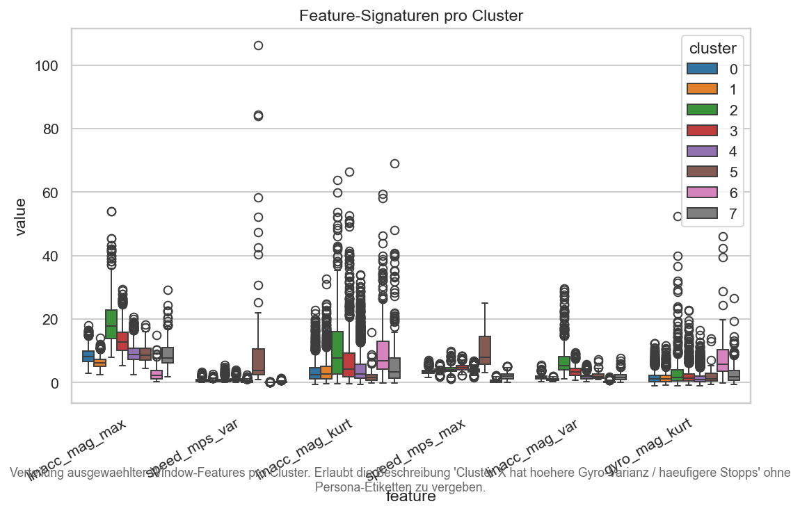

## 2. Externer Track: Synthetische Daten (BA1-Generator)

| algorithm   |   n_clusters |   max_cluster_share | degenerate   |   ari |   nmi |   v_measure |   fmi |   silhouette |
|:------------|-------------:|--------------------:|:-------------|------:|------:|------------:|------:|-------------:|
| kmeans      |           10 |               0.160 | False        | 0.288 | 0.418 |       0.418 | 0.369 |        0.137 |
| gmm_full    |           10 |               0.224 | False        | 0.216 | 0.352 |       0.352 | 0.314 |        0.118 |
| gmm_diag    |           10 |               0.149 | False        | 0.277 | 0.409 |       0.409 | 0.355 |        0.100 |
| ahc_ward    |           10 |               0.312 | False        | 0.213 | 0.358 |       0.358 | 0.322 |        0.109 |
| ahc_avg     |           10 |               0.731 | False        | 0.101 | 0.382 |       0.382 | 0.352 |        0.263 |
| spectral    |           10 |               0.304 | False        | 0.197 | 0.394 |       0.394 | 0.324 |        0.130 |
| dbscan      |            1 |               1.000 | True         | 0.001 | 0.021 |       0.021 | 0.309 |      nan     |

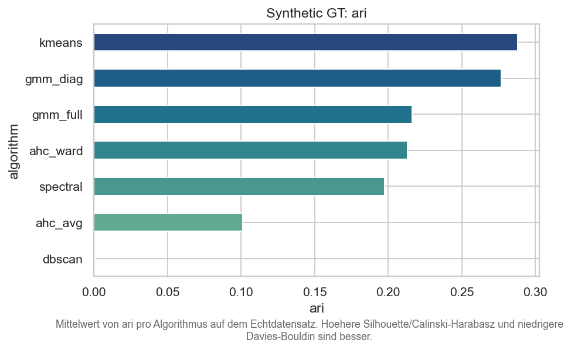

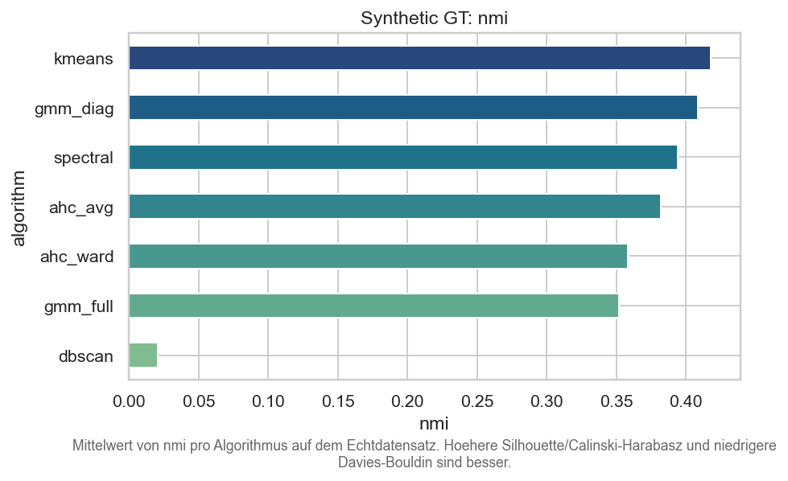

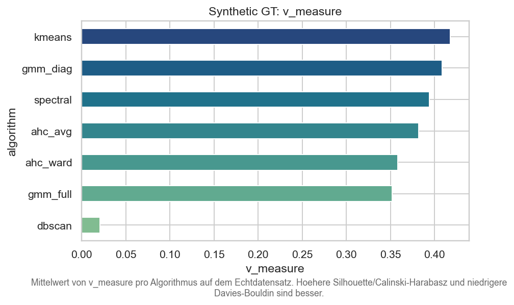

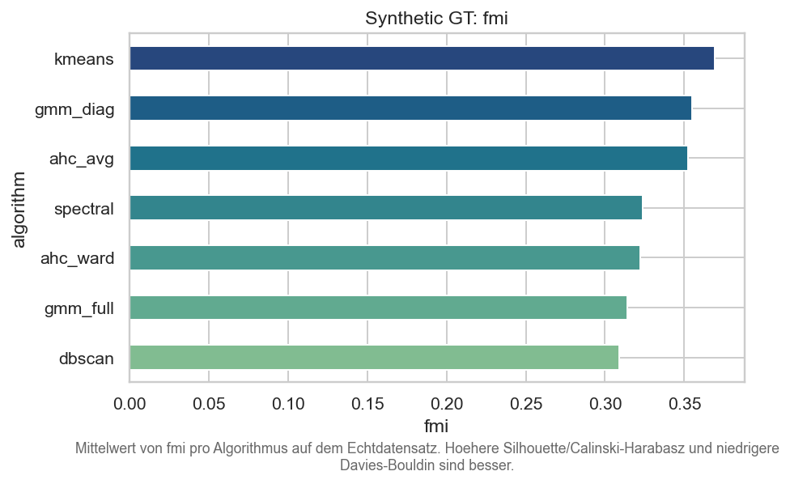

Bester nicht-degenerierter Algorithmus nach ARI: `kmeans` (ARI = 0.288). Dieser Track validiert, welche Algorithmen die 10 BA1-Personas (Commuter, Sport, MTB, E-Bike, Urban LastMile, ...) ueberhaupt rekonstruieren koennen.

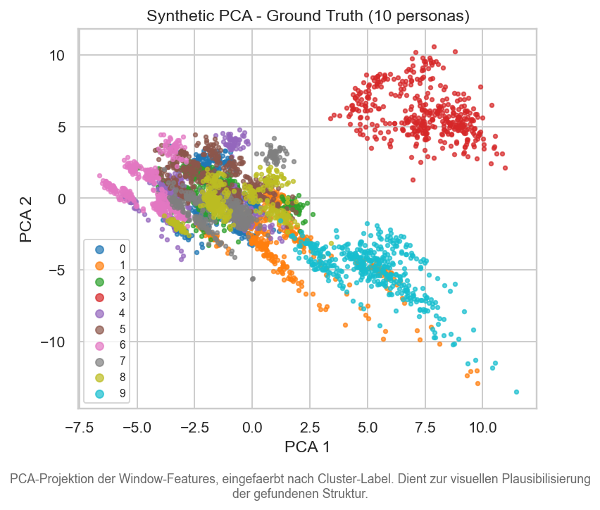

## 3. Robustheit gegen kontrollierte Augmentationen (Echtdaten)

Aggregation nur ueber **nicht-degenerierte Laeufe** und nur ueber **Stoerstufen > 0** (level=0 ist die Baseline ohne Stoerung, dort ist stability_ari trivial = 1.0 fuer jeden Algorithmus und wuerde die Mittelwerte kuenstlich aufblasen). DBSCAN und AHC-Average sind hier deshalb meist gar nicht oder nur teilweise gelistet: ihre 'perfekte Stabilitaet' unter Augmentation ist ein Artefakt davon, dass sie unter Stoerung trivialerweise weiter eine Ein-Cluster-Partition ausgeben (DBSCAN) bzw. das Chaining konservieren (AHC-avg).

| augmentation   | algorithm   |   sil_mean |   stability_mean |
|:---------------|:------------|-----------:|-----------------:|
| drift          | ahc_ward    |      0.110 |            0.436 |
| drift          | gmm_diag    |      0.048 |            0.344 |
| drift          | gmm_full    |      0.049 |            0.596 |
| drift          | kmeans      |      0.118 |            0.524 |
| drift          | spectral    |      0.130 |            0.870 |
| dropout        | ahc_ward    |      0.064 |            0.277 |
| dropout        | gmm_diag    |      0.039 |            0.245 |
| dropout        | gmm_full    |     -0.014 |            0.245 |
| dropout        | kmeans      |      0.088 |            0.725 |
| dropout        | spectral    |      0.098 |            0.440 |
| noise          | ahc_ward    |      0.133 |            0.369 |
| noise          | gmm_diag    |      0.055 |            0.324 |
| noise          | gmm_full    |      0.061 |            0.264 |
| noise          | kmeans      |      0.118 |            0.539 |
| noise          | spectral    |      0.138 |            0.840 |

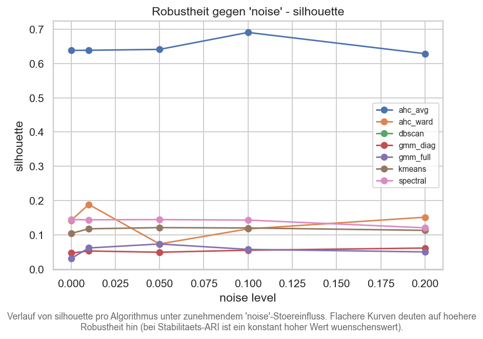

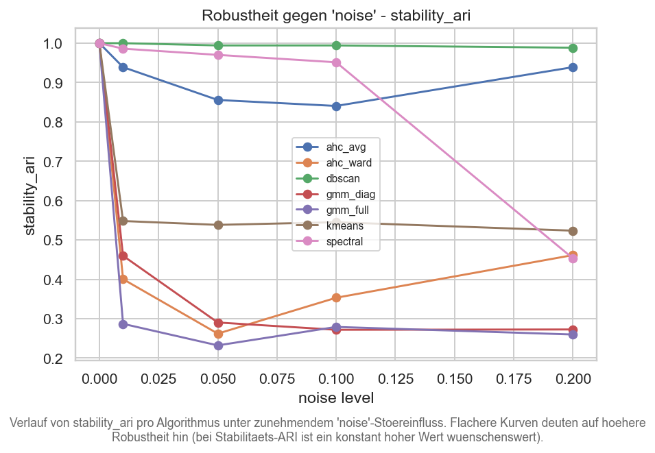

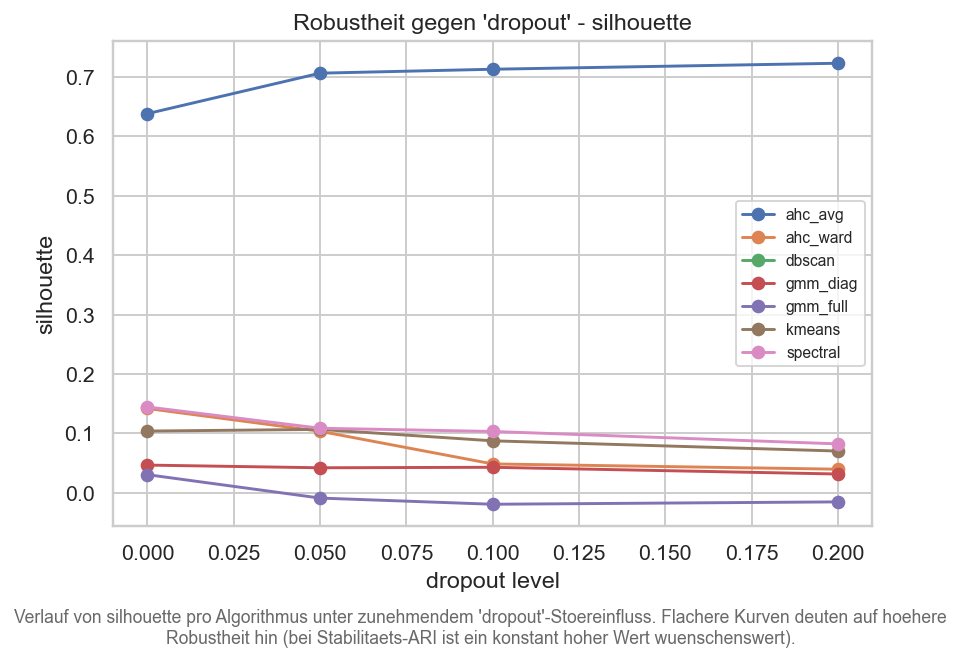

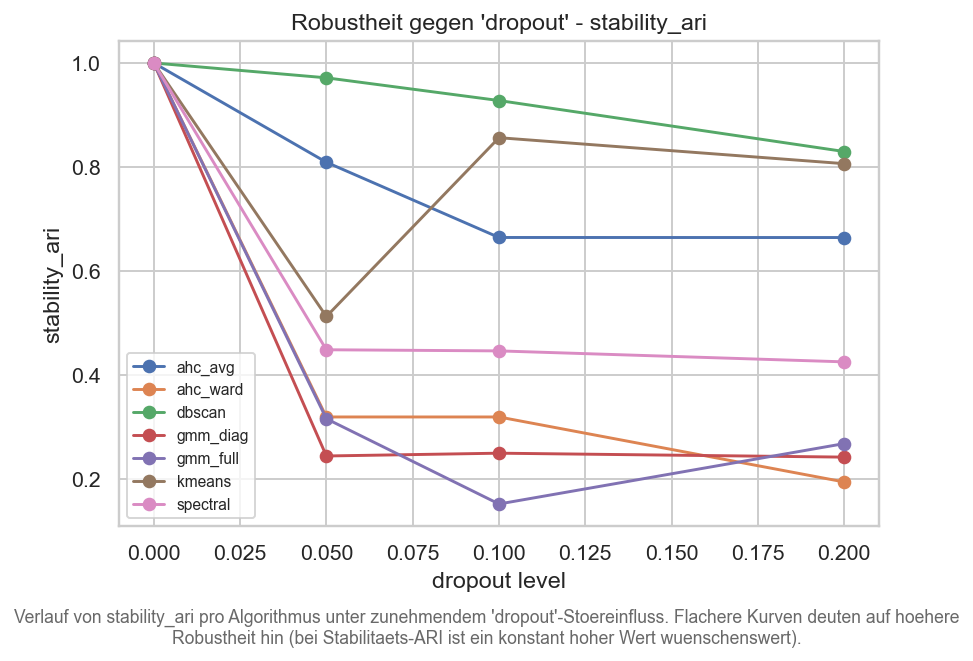

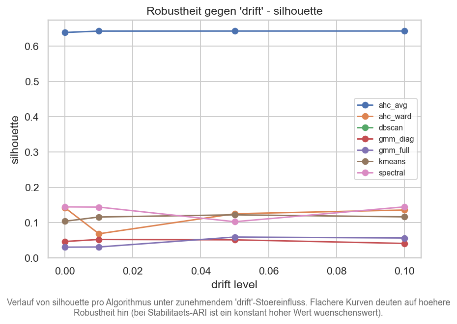

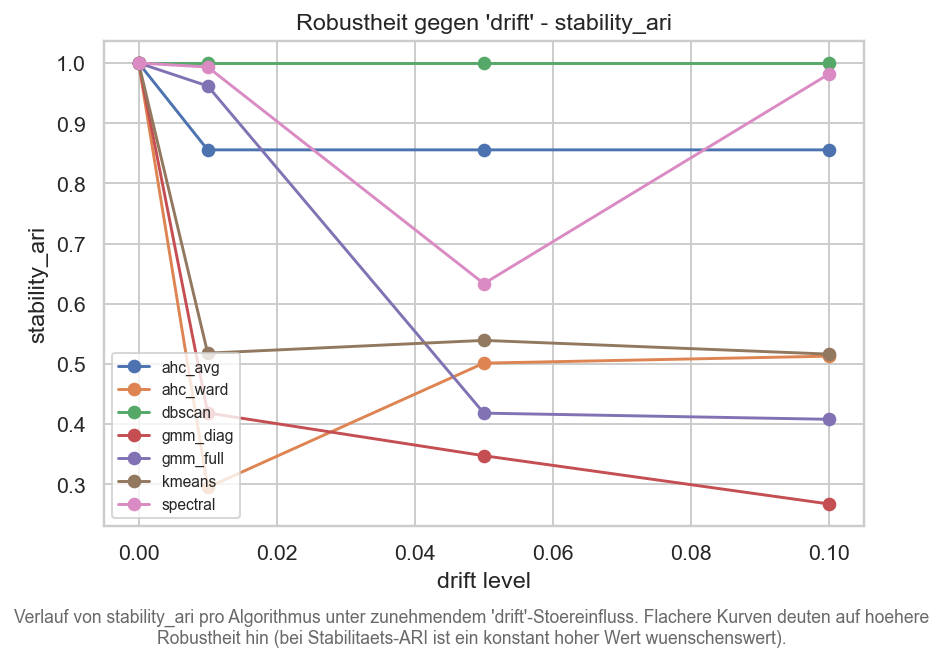

**Robustester nicht-degenerierter Algorithmus pro Stoertyp (mittlere Stabilitaets-ARI):**

| augmentation   | algorithm   |   stability_ari |
|:---------------|:------------|----------------:|
| drift          | spectral    |           0.870 |
| dropout        | kmeans      |           0.725 |
| noise          | spectral    |           0.840 |

## 4. Active Learning (explorativ, synthetische Daten)

**Endstand pro Strategie:**

| strategy    |   round |   n_labeled |   ari |   mean_entropy_unlabeled |
|:------------|--------:|------------:|------:|-------------------------:|
| random      |      15 |         330 | 0.358 |                    0.944 |
| uncertainty |      15 |         330 | 0.260 |                    0.791 |

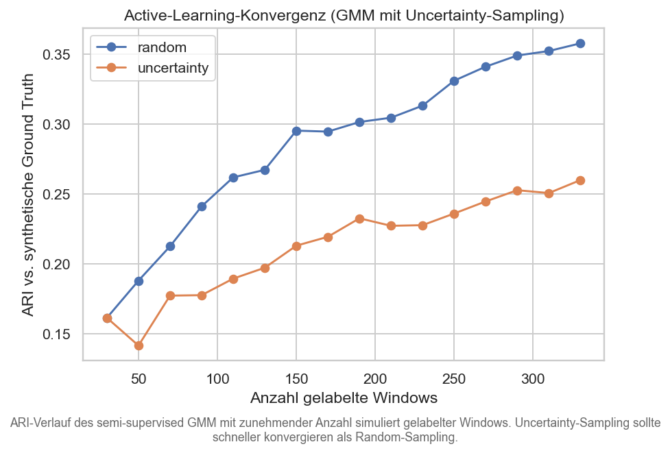

**ARI-Verbesserung erstes -> letztes Round:**

| strategy    |   first |   last |   delta_ari |
|:------------|--------:|-------:|------------:|
| random      |   0.161 |  0.358 |       0.196 |
| uncertainty |   0.161 |  0.260 |       0.099 |

## 5. Zusammenfassende Empfehlung

- Bester Algorithmus nach **Bootstrap-Stabilitaet (Echtdaten)**: `gmm_diag`.
- Bester nicht-degenerierter Algorithmus nach **mittlerer Robustheits-ARI** ueber alle Stoertypen: `spectral` (mean = 0.729).

- Bester Algorithmus nach **ARI auf synthetischer Ground Truth** (10 Personas): `kmeans` (ARI = 0.288).
