# Analysebericht

Gepruefte Clusteranzahlen: k in {5, 6, 7, 8}.

## 1. k-Auswahl: Evidenz aus der Modellselektion

Die Silhouette (K-Means) ist maximal bei **k = 5**.

|     k |    inertia |   silhouette |   davies_bouldin |   calinski_harabasz |
|------:|-----------:|-------------:|-----------------:|--------------------:|
| 2.000 | 313573.846 |        0.192 |            2.143 |            1095.055 |
| 3.000 | 284963.340 |        0.167 |            1.869 |             952.511 |
| 4.000 | 260458.766 |        0.169 |            1.577 |             913.330 |
| 5.000 | 236769.484 |        0.201 |            1.428 |             927.815 |
| 6.000 | 222201.384 |        0.141 |            1.621 |             882.210 |
| 7.000 | 211651.194 |        0.117 |            1.652 |             829.619 |
| 8.000 | 203976.845 |        0.104 |            1.753 |             775.205 |

Der BIC (GMM) ist minimal (bestes Modell) bei **k = 6**.

|     k |         bic |         aic |   silhouette |
|------:|------------:|------------:|-------------:|
| 2.000 |  -53428.296 |  -73027.217 |        0.318 |
| 3.000 | -105400.395 | -134802.201 |        0.222 |
| 4.000 | -182152.754 | -221357.446 |        0.110 |
| 5.000 | -215967.898 | -264975.475 |        0.065 |
| 6.000 | -225250.874 | -284061.338 |        0.063 |
| 7.000 | -223761.334 | -292374.683 |        0.079 |
| 8.000 | -221770.268 | -300186.502 |        0.031 |

## 2. Sensitivitatsanalyse: Vergleich uber k

**Bestes nicht-degeneriertes Verfahren je k** (Kriterium: Bootstrap-Stabilitats-ARI):

|   k | best_algorithm   |   stability_mean_ari |   silhouette |   davies_bouldin |   calinski_harabasz |
|----:|:-----------------|---------------------:|-------------:|-----------------:|--------------------:|
|   5 | kmeans           |                0.893 |        0.201 |            1.428 |             927.815 |
|   6 | gmm_full         |                0.864 |        0.063 |            2.504 |             461.612 |
|   7 | kmeans           |                0.868 |        0.117 |            1.652 |             829.619 |
|   8 | gmm_diag         |                0.726 |        0.047 |            2.327 |             499.778 |

> Das beste Verfahren wechselt zwischen den k-Werten (gmm_diag, gmm_full, kmeans); die Wahl von k beeinflusst die Schlussfolgerung und wird unten diskutiert.

**Bootstrap-Stabilitat (mean ARI) je Verfahren x k:**

| algorithm   |   k=5 |   k=6 |   k=7 |   k=8 |
|:------------|------:|------:|------:|------:|
| kmeans      | 0.893 | 0.827 | 0.868 | 0.612 |
| gmm_full    | 0.828 | 0.864 | 0.761 | 0.518 |
| gmm_diag    | 0.497 | 0.509 | 0.291 | 0.726 |
| ahc_ward    | 0.366 | 0.367 | 0.366 | 0.368 |
| ahc_avg     | 0.730 | 0.795 | 0.864 | 0.874 |
| spectral    | 0.790 | 0.752 | 0.329 | 0.675 |
| dbscan      | 0.982 | 0.982 | 0.982 | 0.982 |

**Silhouette je Verfahren x k:**

| algorithm   |     k=5 |     k=6 |     k=7 |     k=8 |
|:------------|--------:|--------:|--------:|--------:|
| kmeans      |   0.201 |   0.141 |   0.117 |   0.104 |
| gmm_full    |   0.065 |   0.063 |   0.079 |   0.031 |
| gmm_diag    |   0.093 |   0.045 |   0.086 |   0.047 |
| ahc_ward    |   0.143 |   0.135 |   0.136 |   0.142 |
| ahc_avg     |   0.694 |   0.694 |   0.660 |   0.638 |
| spectral    |   0.230 |   0.219 |   0.108 |   0.145 |
| dbscan      | nan     | nan     | nan     | nan     |

## 3. Robustheit uber k (mittlere Stabilitats-ARI unter Stoerung)

Aggregiert nur uber nicht-degenerierte Laeufe und Stoerstufen > 0:

| algorithm   |   k=5 |   k=6 |   k=7 |   k=8 |
|:------------|------:|------:|------:|------:|
| ahc_ward    | 0.392 | 0.385 | 0.373 | 0.362 |
| gmm_diag    | 0.521 | 0.332 | 0.476 | 0.306 |
| gmm_full    | 0.519 | 0.481 | 0.513 | 0.358 |
| kmeans      | 0.914 | 0.954 | 0.912 | 0.590 |
| spectral    | 0.946 | 0.943 | 0.687 | 0.729 |

## 4. Detailergebnisse je k

### k = 5

| algorithm   |   n_clusters |   n_noise |   max_cluster_share | degenerate   |   silhouette |   davies_bouldin |   calinski_harabasz |   stability_mean_ari |   stability_std_ari |
|:------------|-------------:|----------:|--------------------:|:-------------|-------------:|-----------------:|--------------------:|---------------------:|--------------------:|
| kmeans      |            5 |         0 |               0.593 | False        |        0.201 |            1.428 |             927.815 |                0.893 |               0.139 |
| gmm_full    |            5 |         0 |               0.606 | False        |        0.065 |            2.572 |             506.327 |                0.828 |               0.125 |
| gmm_diag    |            5 |         0 |               0.396 | False        |        0.093 |            2.126 |             672.495 |                0.497 |               0.310 |
| ahc_ward    |            5 |         0 |               0.500 | False        |        0.143 |            1.696 |             739.337 |                0.366 |               0.068 |
| ahc_avg     |            5 |         0 |               0.996 | True         |        0.694 |            0.466 |             233.157 |                0.730 |               0.227 |
| spectral    |            5 |         0 |               0.703 | False        |        0.230 |            1.394 |             528.567 |                0.790 |               0.078 |
| dbscan      |            1 |       189 |               1.000 | True         |      nan     |          nan     |             nan     |                0.982 |               0.014 |

Bestes nicht-degeneriertes Verfahren: `kmeans` (Stability ARI = 0.893).

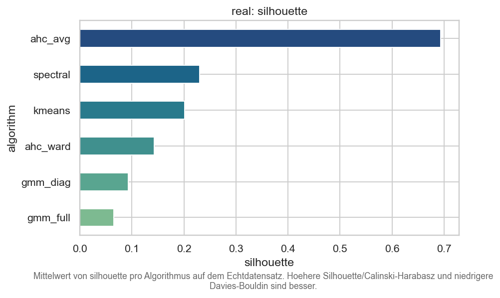

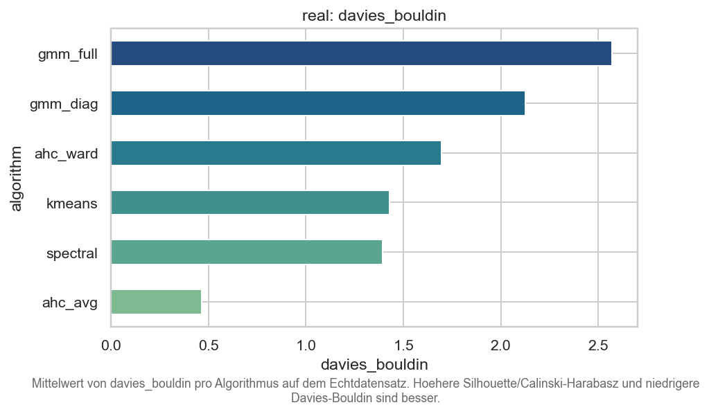

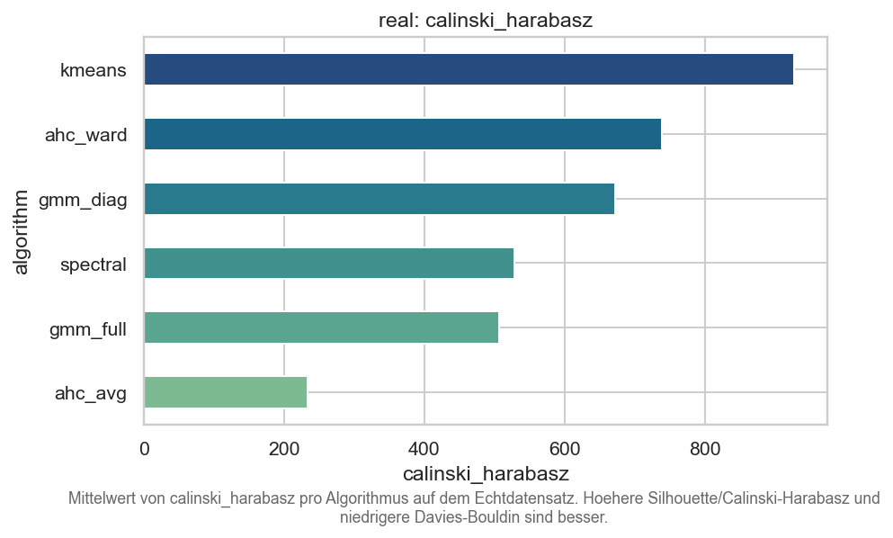

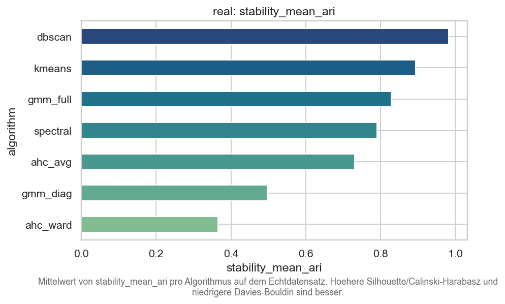

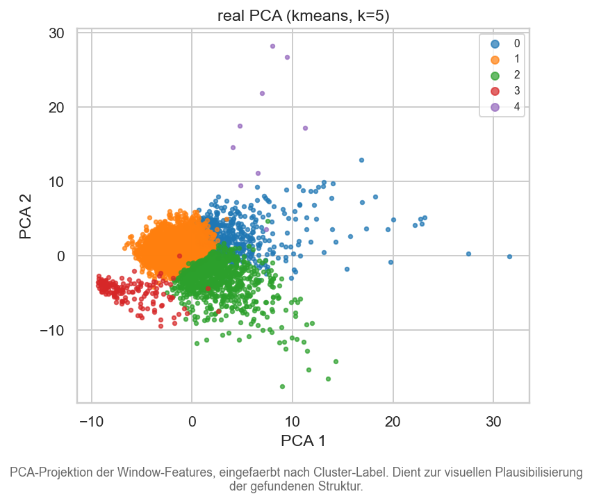

### k = 6

| algorithm   |   n_clusters |   n_noise |   max_cluster_share | degenerate   |   silhouette |   davies_bouldin |   calinski_harabasz |   stability_mean_ari |   stability_std_ari |
|:------------|-------------:|----------:|--------------------:|:-------------|-------------:|-----------------:|--------------------:|---------------------:|--------------------:|
| kmeans      |            6 |         0 |               0.447 | False        |        0.141 |            1.621 |             882.210 |                0.827 |               0.243 |
| gmm_full    |            6 |         0 |               0.576 | False        |        0.063 |            2.504 |             461.612 |                0.864 |               0.053 |
| gmm_diag    |            6 |         0 |               0.477 | False        |        0.045 |            2.174 |             519.931 |                0.509 |               0.286 |
| ahc_ward    |            6 |         0 |               0.500 | False        |        0.135 |            1.647 |             714.338 |                0.367 |               0.074 |
| ahc_avg     |            6 |         0 |               0.996 | True         |        0.694 |            0.403 |             189.426 |                0.795 |               0.084 |
| spectral    |            6 |         0 |               0.697 | False        |        0.219 |            1.291 |             603.698 |                0.752 |               0.218 |
| dbscan      |            1 |       189 |               1.000 | True         |      nan     |          nan     |             nan     |                0.982 |               0.014 |

Bestes nicht-degeneriertes Verfahren: `gmm_full` (Stability ARI = 0.864).

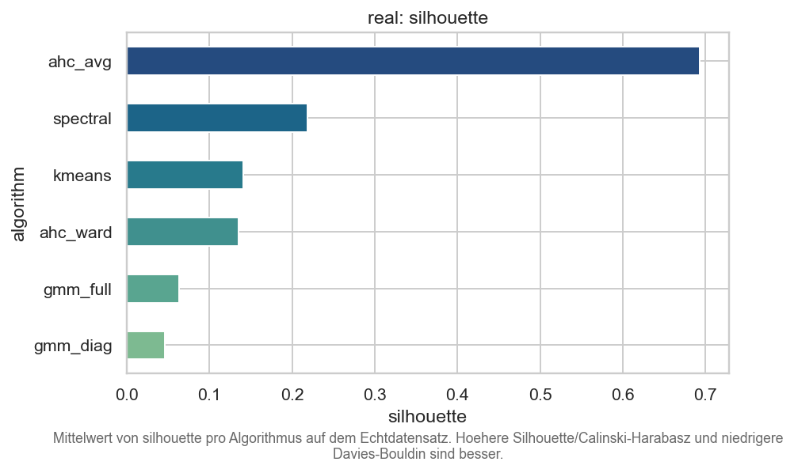

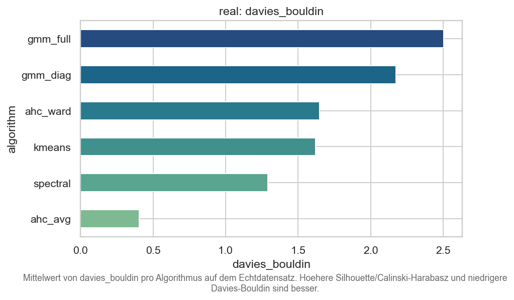

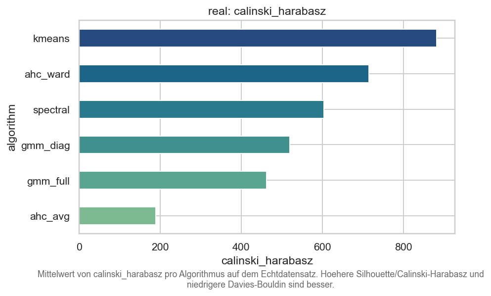

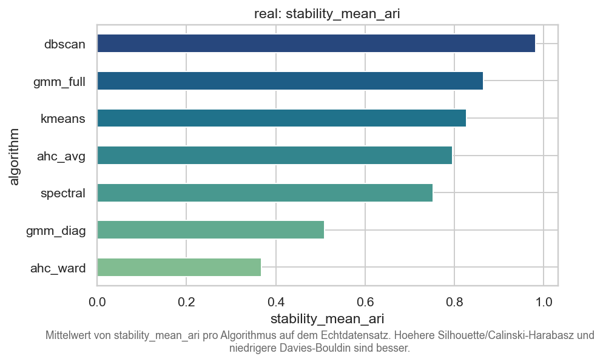

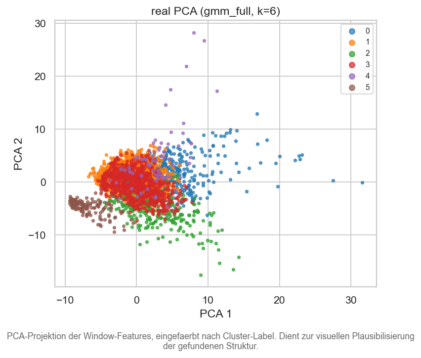

### k = 7

| algorithm   |   n_clusters |   n_noise |   max_cluster_share | degenerate   |   silhouette |   davies_bouldin |   calinski_harabasz |   stability_mean_ari |   stability_std_ari |
|:------------|-------------:|----------:|--------------------:|:-------------|-------------:|-----------------:|--------------------:|---------------------:|--------------------:|
| kmeans      |            7 |         0 |               0.354 | False        |        0.117 |            1.652 |             829.619 |                0.868 |               0.140 |
| gmm_full    |            7 |         0 |               0.556 | False        |        0.079 |            2.249 |             439.855 |                0.761 |               0.154 |
| gmm_diag    |            7 |         0 |               0.344 | False        |        0.086 |            1.868 |             577.673 |                0.291 |               0.026 |
| ahc_ward    |            7 |         0 |               0.500 | False        |        0.136 |            1.481 |             681.921 |                0.366 |               0.072 |
| ahc_avg     |            7 |         0 |               0.994 | True         |        0.660 |            0.571 |             190.205 |                0.864 |               0.038 |
| spectral    |            7 |         0 |               0.466 | False        |        0.108 |            1.565 |             565.492 |                0.329 |               0.113 |
| dbscan      |            1 |       189 |               1.000 | True         |      nan     |          nan     |             nan     |                0.982 |               0.014 |

Bestes nicht-degeneriertes Verfahren: `kmeans` (Stability ARI = 0.868).

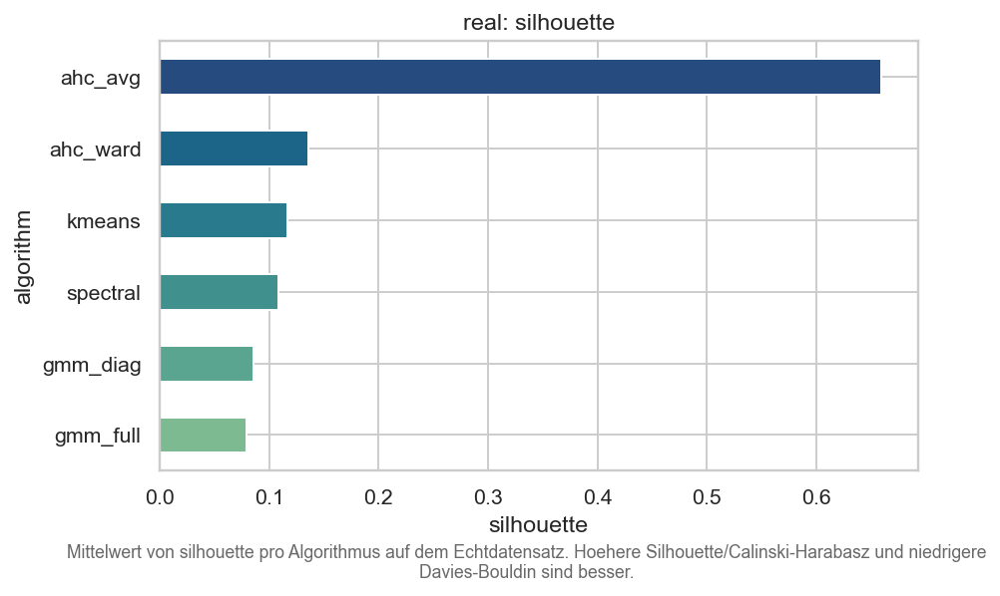

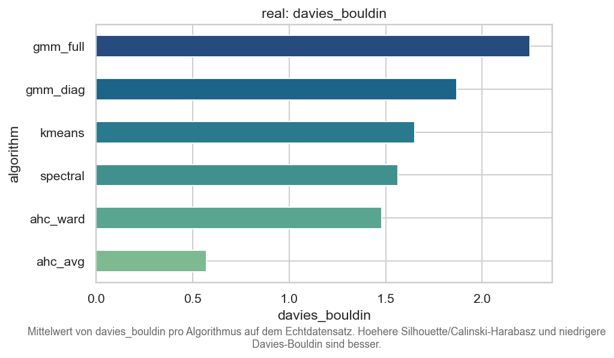

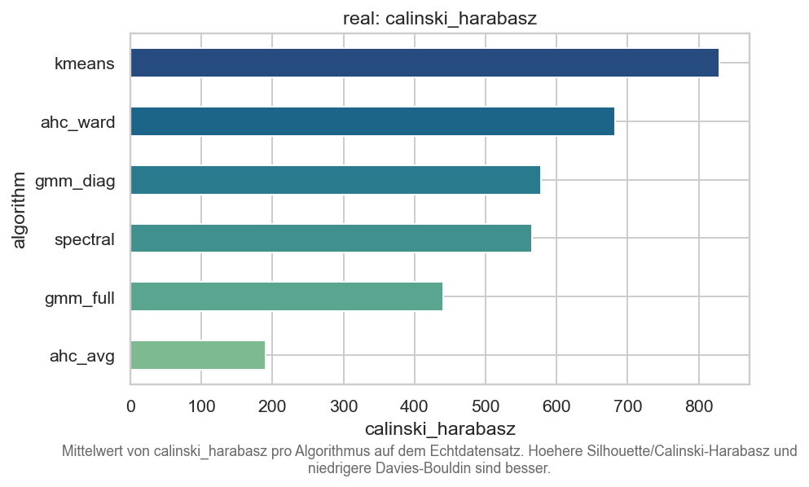

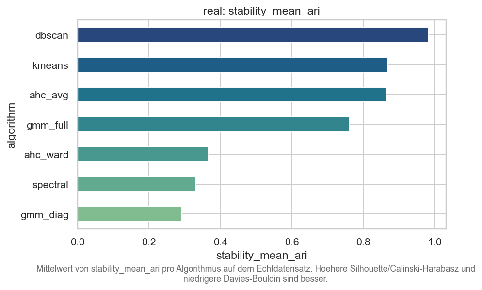

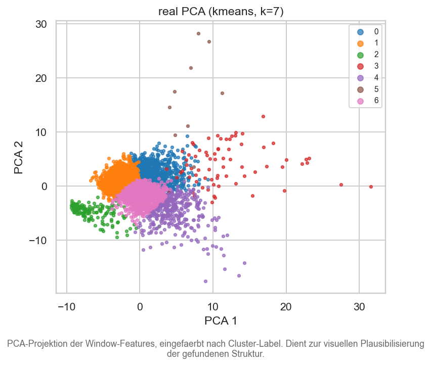

### k = 8

| algorithm   |   n_clusters |   n_noise |   max_cluster_share | degenerate   |   silhouette |   davies_bouldin |   calinski_harabasz |   stability_mean_ari |   stability_std_ari |
|:------------|-------------:|----------:|--------------------:|:-------------|-------------:|-----------------:|--------------------:|---------------------:|--------------------:|
| kmeans      |            8 |         0 |               0.274 | False        |        0.104 |            1.753 |             775.205 |                0.612 |               0.150 |
| gmm_full    |            8 |         0 |               0.482 | False        |        0.031 |            2.225 |             534.024 |                0.518 |               0.130 |
| gmm_diag    |            8 |         0 |               0.404 | False        |        0.047 |            2.327 |             499.778 |                0.726 |               0.198 |
| ahc_ward    |            8 |         0 |               0.500 | False        |        0.142 |            1.389 |             656.944 |                0.368 |               0.069 |
| ahc_avg     |            8 |         0 |               0.994 | True         |        0.638 |            0.551 |             165.177 |                0.874 |               0.039 |
| spectral    |            8 |         0 |               0.469 | False        |        0.145 |            1.506 |             523.832 |                0.675 |               0.180 |
| dbscan      |            1 |       189 |               1.000 | True         |      nan     |          nan     |             nan     |                0.982 |               0.014 |

Bestes nicht-degeneriertes Verfahren: `gmm_diag` (Stability ARI = 0.726).

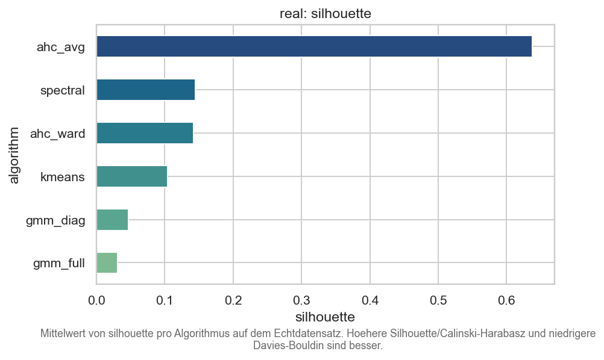

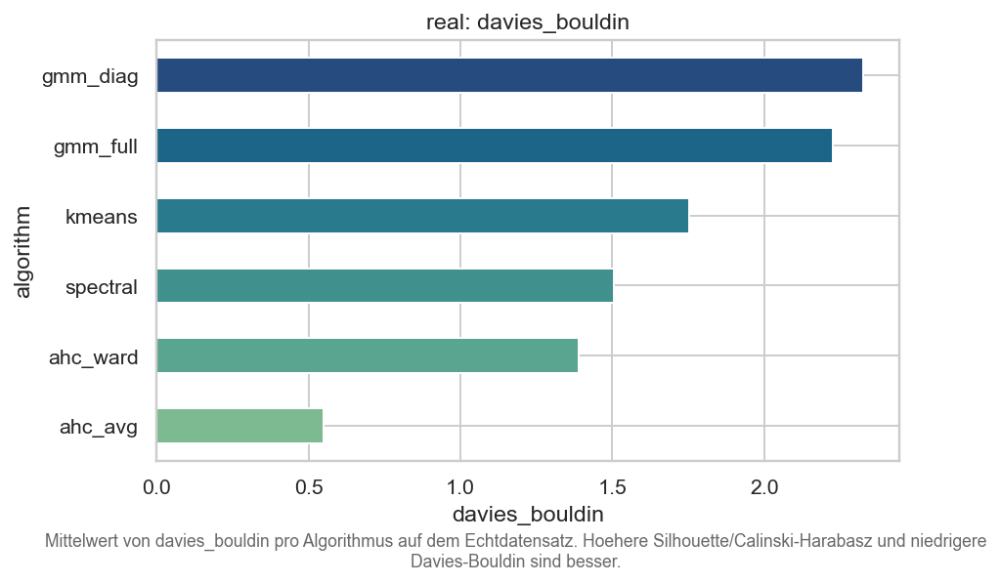

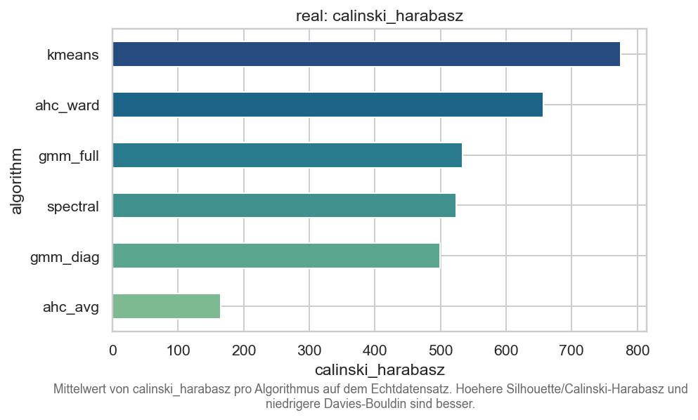

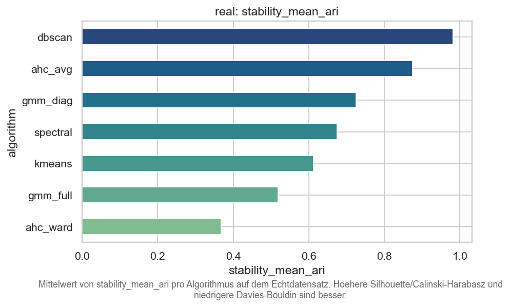

## 5. k-unabhaengige Tracks

### 5.1 Synthetischer externer Track

| algorithm   |   n_clusters |   max_cluster_share | degenerate   |   ari |   nmi |   v_measure |   fmi |   silhouette |
|:------------|-------------:|--------------------:|:-------------|------:|------:|------------:|------:|-------------:|
| kmeans      |           10 |               0.160 | False        | 0.288 | 0.418 |       0.418 | 0.369 |        0.137 |
| gmm_full    |           10 |               0.224 | False        | 0.216 | 0.352 |       0.352 | 0.314 |        0.118 |
| gmm_diag    |           10 |               0.149 | False        | 0.277 | 0.409 |       0.409 | 0.355 |        0.100 |
| ahc_ward    |           10 |               0.312 | False        | 0.213 | 0.358 |       0.358 | 0.322 |        0.109 |
| ahc_avg     |           10 |               0.731 | False        | 0.101 | 0.382 |       0.382 | 0.352 |        0.263 |
| spectral    |           10 |               0.304 | False        | 0.197 | 0.394 |       0.394 | 0.324 |        0.130 |
| dbscan      |            1 |               1.000 | True         | 0.001 | 0.021 |       0.021 | 0.309 |      nan     |

### 5.2 Active Learning (explorativ)

**Endstand pro Strategie:**

| strategy    |   round |   n_labeled |   ari |   mean_entropy_unlabeled |
|:------------|--------:|------------:|------:|-------------------------:|
| random      |      15 |         330 | 0.358 |                    0.944 |
| uncertainty |      15 |         330 | 0.260 |                    0.791 |

